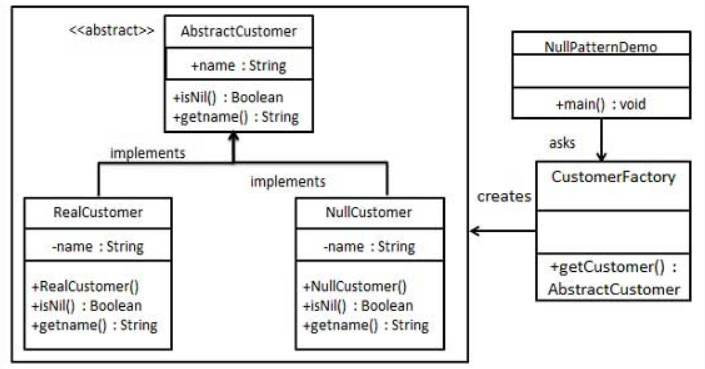

## 意图
使用一个空对象代替null值，这个空对象实现了相同的接口，
但对请求不做任何操作或提供默认操作。

## 主要解决的问题
空对象模式解决的是在系统中使用null值可能导致的问题，
如NullPointerException异常。
它允许系统在没有合适对象时，使用一个"安全"的空对象继续运行，
而不是失败。

## 使用场景
当系统中需要处理null对象，但又希望避免null检查或处理null值时。

## 实现方式
- 定义协议：定义一个协议或接口，规定需要实现的行为。
- 创建具体对象：实现协议的具体对象，提供实际的行为。
- 创建空对象：也实现相同的协议，但提供"空"的实现， 即不执行任何有意义的操作。

## 关键代码
- 协议或接口：规定对象需要实现的方法。
- 具体对象：实现了协议，包含实际的业务逻辑。
- 空对象：实现了协议，但方法实现为空或默认行为。

## 应用实例
- 日志系统：在日志系统中，空对象可能代表一个不执行任何操作的日志器。
- 默认用户：在一个系统中，如果当前没有用户，可以使用一个空用户对象代替null。

## 优点
- 避免空值检查：消除了代码中的null值检查。
- 简化客户端代码：客户端可以无视对象是否为空，直接调用方法。
- 扩展性：添加新的具体对象对客户端透明，无需修改现有代码。

## 缺点
- 可能隐藏错误：使用空对象可能隐藏了错误或异常情况，导致难以调试。
- 增加设计复杂性：需要为每个可能返回null的接口实现一个空对象。

## 使用建议
在系统中需要处理null值，但又希望简化错误处理和避免null检查时，
考虑使用空对象模式。

## 注意事项
- 空对象模式应该谨慎使用，确保它不会掩盖错误或隐藏系统的真实状态。
- 空对象应该提供和具体对象相同的接口，使得客户端代码无需改变即可使用。

## 结构
空对象模式包含以下几个主要角色：
- 抽象对象（Abstract Object）：
> 定义了客户端所期望的接口。这个接口可以是一个抽象类或接口。
- 具体对象（Concrete Object）：
> 实现了抽象对象接口的具体类。这些类提供了真实的行为。
- 空对象（Null Object）：
> 实现了抽象对象接口的空对象类。这个类提供了默认的无效行为，
> 以便在对象不可用或不可用时使用。它可以作为具体对象的替代者，
> 在客户端代码中代替空值检查。

## 实现
我们将创建一个定义操作（在这里，是客户的名称）的AbstractCustomer抽象类，
和扩展了AbstractCustomer类的实体类。
工厂类CustomerFactory基于客户传递的名字来返回RealCustomer
或NullCustomer对象。
NullPatternDemo，我们的演示类使用CustomerFactory来演示空对象模式的用法。

## UML图

## 步骤
1. 创建一个抽象类（AbstractCustomer）；
2. 创建扩展了上述类的实体类（RealCustomer、NullCustomer）；
3. 创建CustomerFactory类（CustomerFactory）；
4. 使用CustomerFactory，基于客户传递的名字，来获取RealCustomer或NullCustomer对象（NullPatternDemo）。