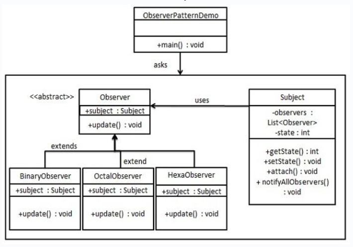

## 意图
创建了对象间的一种一对多的依赖关系，当一个对象状态改变时，
所有依赖于它的对象都会得到通知并自动更新。

## 主要解决的问题
观察者模式解决的是一个对象状态改变时，
如何自动通知其他依赖对象的问题，
同时保持对象间的低耦合和高协作性。

## 使用场景
当一个对象的状态变化需要同时更新其他对象时。

## 实现方式
- 定义观察者接口：包含一个更新方法。
- 创建具体观察者：实现观察者接口，定义接收到通知时的行为。
- 定义主题接口：包含添加、删除和通知观察者的方法。
- 创建具体主题：实现主题接口，管理观察者列表，并在状态改变时通知它们。

## 关键代码
观察者列表：在主题中维护一个观察者列表。

## 应用实例
- 拍卖系统：拍卖师作为主题，竞价者作为观察者，拍卖价格更新时通知所有竞价者。
- 西游记故事：菩萨洒水作为状态改变，老乌龟作为观察者，观察到这一变化。

## 优点
- 抽象耦合：观察者和主题之间是抽象耦合的。
- 触发机制：建立了一套状态改变时的触发和通知机制。

## 缺点
- 性能问题：如果观察者众多，通知过程可能耗时。
- 循环依赖：可能导致循环调用和系统崩溃。
- 缺乏变化详情：观察者不知道主题如何变化，只知道变化发生。

## 使用建议
- 在需要降低对象间耦合度，并且对象状态变化需要触发其他对象变化时使用。
- 考虑使用Java内置的观察者模式支持类，如java.util.Observable和java.util.Observer。

## 注意事项
- 避免循环引用：注意观察者和主题之间的依赖关系，避免循环引用。
- 异步执行：考虑使用异步通知避免单点故障导致整个系统卡壳。

## 结构
观察者模式包含以下几个核心角色：
- 主题（Subject）：
> 也称为被观察者或可观察者，它是具有状态的对象，
> 并维护着一个观察者列表。主题提供了添加、删除和通知观察者的方法。
- 观察者（Observer）：
> 观察者是接收主题通知的对象。观察者需要实现一个更新方法，
> 当收到主题的通知时，调用该方法进行更新操作。
- 具体主题（Concrete Subject）：
> 具体主题是主题的具体实现类。它维护着观察者列表，
> 并在状态发生改变时通知观察者。
- 具体观察者（Concrete Observer）：
> 具体观察者是观察者的具体实现类。它实现了更新方法，
> 定义了在收到主题通知时需要执行的具体操作。

观察者模式通过将主题和观察者解耦，实现了对象之间的松耦合。当主题的状态发生改变时，所有依赖于它的观察者都会收到通知并进行相应的更新。

## 实现
观察者模式使用三个类Subject、Observer和Client。
Subject对象带有绑定观察者到Client对象
和从Client对象解绑观察者的方法。
我们创建Subject类、Observer抽象类
和扩展了抽象类Observer的实体类。
ObserverPatternDemo，我们的演示类使用Subject
和实体类对象来演示观察者模式。

## UML图

## 步骤
1. 创建Subject类（Subject）；
2. 创建Observer类（Observer）；
3. 创建实体观察者类（BinaryObserver、OctalObserver、HexaObserver）；
4. 使用Subject和实体观察者对象（ObserverPatternDemo）。