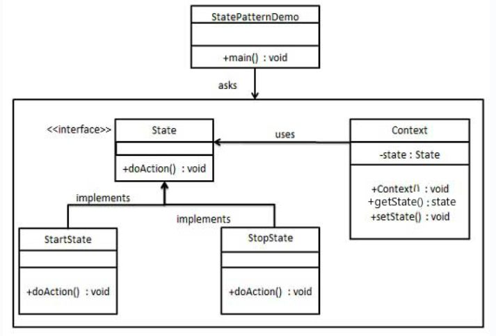

## 意图
允许一个对象在其内部状态改变时改变其行为，
看起来就像是改变了其类一样。

## 主要解决的问题
状态模式解决对象行为依赖于其状态的问题，
使得对象可以在状态变化时切换行为。

## 使用场景
当代码中存在大量条件语句，且这些条件语句依赖于对象的状态时。

## 实现方式
- 定义状态接口：声明一个或多个方法，用于封装具体状态的行为。
- 创建具体状态类：实现状态接口，根据状态的不同实现具体的行为。
- 定义上下文类：包含一个状态对象的引用，并在状态改变时更新其行为。

## 关键代码
- 状态接口：声明行为方法。
- 具体状态类：实现状态接口，封装具体行为。
- 上下文类：维护一个状态对象，并提供方法以改变其状态。

## 应用实例
- 篮球运动员状态：运动员可以有正常、不正常和超常等状态。
- 曾侯乙编钟：编钟作为上下文，不同的钟（状态）有不同的演奏效果。

## 优点
- 封装状态转换规则：将状态转换逻辑封装在状态对象内部。
- 易于扩展：增加新的状态类不会影响现有代码。
- 集中状态相关行为：将所有与特定状态相关的行为集中到一个类中。
- 简化条件语句：避免使用大量的条件语句来切换行为。
- 状态共享：允许多个上下文对象共享同一个状态对象。

## 缺点
- 增加类和对象数量：每个状态都需要一个具体的状态类。
- 实现复杂：模式结构和实现相对复杂。
- 开闭原则支持不足：增加新状态或修改状态行为可能需要修改现有代码。

## 使用建议
- 当对象的行为随状态改变而变化时，考虑使用状态模式。
- 状态模式适用于替代复杂的条件或分支语句。

## 注意事项
- 状态模式适用于状态数量有限（通常不超过5个）的情况。
- 谨慎使用，以避免系统变得过于复杂。

## 结构
状态模式包含以下几个主要角色：
- 上下文（Context）：
> 定义了客户感兴趣的接口，并维护一个当前状态对象的引用。
> 上下文可以通过状态对象来委托处理状态相关的行为。
- 状态（State）：
> 定义了一个接口，用于封装与上下文相关的一个状态的行为。
- 具体状态（Concrete State）：
> 实现了状态接口，负责处理与该状态相关的行为。
> 具体状态对象通常会在内部维护一个对上下文对象的引用，
> 以便根据不同的条件切换到不同的状态。

## 实现
我们将创建一个State接口和实现了State接口的实体状态类。
Context是一个带有某个状态的类。
StatePatternDemo，我们的演示类使用Context
和状态对象来演示Context在状态改变时的行为变化。

## UML图

## 步骤
1. 创建一个接口（State）；
2. 创建实现接口的实体类（StartState、StopState）；
3. 创建Context类（Context）；
4. 使用Context来查看当状态State改变时的行为变化（StatePatternDemo）。