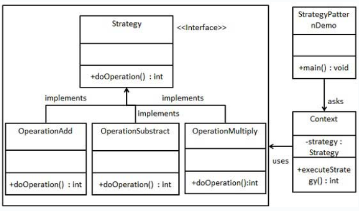

## 意图
将每个算法封装起来，使它们可以互换使用。

## 主要解决的问题
解决在多种相似算法存在时，
使用条件语句（如if...else）导致的复杂性和难以维护的问题。

## 使用场景
当一个系统中有许多类，它们之间的区别仅在于它们的行为时。

## 实现方式
- 定义策略接口：所有策略类都将实现这个统一的接口。
- 创建具体策略类：每个策略类封装一个具体的算法或行为。
- 上下文类：包含一个策略对象的引用，并通过该引用调用策略。

## 关键代码
- 策略接口：规定了所有策略类必须实现的方法。
- 具体策略类：实现了策略接口，包含具体的算法实现。

## 应用实例
- 锦囊妙计：每个锦囊代表一个策略，包含不同的计策。
- 旅行方式选择：骑自行车、坐汽车等，每种方式都是一个可替换的策略。
- Java AWT的LayoutManager：不同的布局管理器实现了相同的接口，但提供了不同的布局算法。

## 优点
- 算法切换自由：可以在运行时根据需要切换算法。
- 避免多重条件判断：消除了复杂的条件语句。
- 扩展性好：新增算法只需新增一个策略类，无需修改现有代码。

## 缺点
- 策略类数量增多：每增加一个算法，就需要增加一个策略类。
- 所有策略类都需要暴露：策略类需要对外公开，以便可以被选择和使用。

## 使用建议
- 当系统中有多种算法或行为，且它们之间可以相互替换时，使用策略模式。
- 当系统需要动态选择算法时，策略模式是一个合适的选择。

## 注意事项
如果系统中策略类数量过多，
考虑使用其他模式或设计技巧来解决类膨胀问题。

## 结构
策略模式包含以下几个核心角色：
- 环境（Context）：
> 维护一个对策略对象的引用，
> 负责将客户端请求委派给具体的策略对象执行。
> 环境类可以通过依赖注入、简单工厂等方式来获取具体策略对象。
- 抽象策略（Abstract Strategy）：
> 定义了策略对象的公共接口或抽象类，
> 规定了具体策略类必须实现的方法。
- 具体策略（Concrete Strategy）：
> 实现了抽象策略定义的接口或抽象类，包含了具体的算法实现。

策略模式通过将算法与使用算法的代码解耦，提供了一种动态选择不同算法的方法。客户端代码不需要知道具体的算法细节，而是通过调用环境类来使用所选择的策略。

## 实现
我们将创建一个定义活动的Strategy接口
和实现了Strategy接口的实体策略类。
Context是一个使用了某种策略的类。
StrategyPatternDemo，我们的演示类使用Context
和策略对象来演示Context在它所配置或使用的策略改变时的行为变化。

## UML图

## 步骤
1. 创建一个接口（Strategy ）；
2. 创建实现接口的实体类（OperationAdd、OperationSubtract、OperationMultiply）；
3. 创建Context类（Context）；
4. 使用Context来查看当它改变策略Strategy时的行为变化（StrategyPatternDemo）。