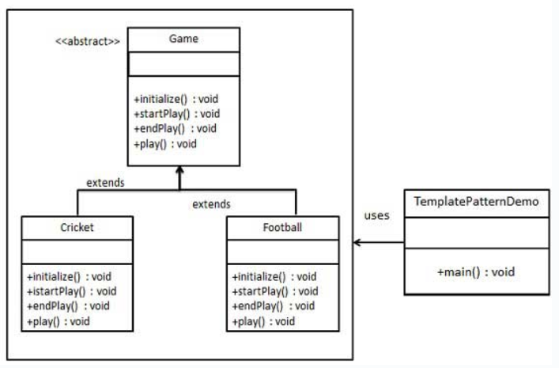

## 意图
在父类中定义了算法的骨架，
并允许子类在不改变算法结构的前提下重定义算法的某些特定步骤。

## 主要解决的问题
解决在多个子类中重复实现相同的方法的问题，
通过将通用方法抽象到父类中来避免代码重复。

## 使用场景
当存在一些通用的方法，可以在多个子类中共用时。

## 实现方式
- 定义抽象父类：包含模板方法和一些抽象方法或具体方法。
- 实现子类：继承抽象父类并实现抽象方法，不改变算法结构。

## 关键代码
- 模板方法：在抽象父类中定义，调用抽象方法和具体方法。
- 抽象方法：由子类实现，代表算法的可变部分。
- 具体方法：在抽象父类中实现，代表算法的不变部分。

## 应用实例
- 建筑流程：地基、走线、水管等步骤相同，后期建筑如加壁橱、栅栏等步骤不同。
- 西游记的81难：菩萨定好的81难代表一个顶层逻辑骨架。
- Spring对Hibernate的支持：封装了如开启事务、获取Session、关闭Session等通用方法。

## 优点
- 封装不变部分：算法的不变部分被封装在父类中。
- 扩展可变部分：子类可以扩展或修改算法的可变部分。
- 提取公共代码：减少代码重复，便于维护。

## 缺点
类数目增加：每个不同的实现都需要一个子类，可能导致系统庞大。

## 使用建议
- 当有多个子类共有的方法且逻辑相同时，考虑使用模板方法模式。
- 对于重要或复杂的方法，可以考虑作为模板方法定义在父类中。

## 注意事项
为了防止恶意修改，模板方法通常使用final关键字修饰，避免被子类重写。

## 包含的几个主要角色
- 抽象父类（Abstract Class）：
> 定义了模板方法和一些抽象方法或具体方法。
- 具体子类（Concrete Classes）：
> 继承自抽象父类，并实现抽象方法。
- 钩子方法（Hook Method）（可选）：
> 在抽象父类中定义，可以被子类重写，以影响模板方法的行为。
- 客户端（Client）（可选）：
> 使用抽象父类和具体子类，无需关心模板方法的细节。

## 实现
我们将创建一个定义操作的Game抽象类，
其中，模板方法设置为final，这样它就不会被重写。
Cricket和Football是扩展了Game的实体类，
它们重写了抽象类的方法。
TemplatePatternDemo，我们的演示类使用Game来演示模板模式的用法。

## UML图

## 步骤
1. 创建一个抽象类，它的模板方法被设置为final（Game）；
2. 创建扩展了上述类的实体类（Cricket、Football）；
3. 使用Game的模板方法play()来演示游戏的定义方式（TemplatePatternDemo）。