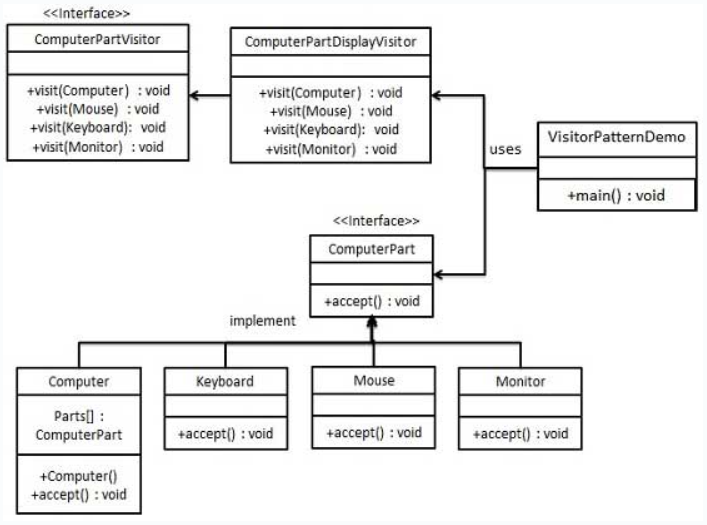

## 意图
旨在将数据结构与在该数据结构上执行的操作分离，
从而使得添加新的操作变得更容易，而无需修改数据结构本身。

## 主要解决的问题
解决在稳定数据结构和易变操作之间的耦合问题，
使得操作可以独立于数据结构变化。

## 使用场景
当需要对一个对象结构中的对象执行多种不同的且不相关的操作时，
尤其是这些操作需要避免"污染"对象类本身。

## 实现方式
- 定义访问者接口：声明一系列访问方法，一个访问方法对应数据结构中的一个元素类。
- 创建具体访问者：实现访问者接口，为每个访问方法提供具体实现。
- 定义元素接口：声明一个接受访问者的方法。
- 创建具体元素：实现元素接口，每个具体元素类对应数据结构中的一个具体对象。

## 关键代码
- 访问者接口：包含访问不同元素的方法。
- 具体访问者：实现了访问者接口，包含对每个元素类的访问逻辑。
- 元素接口：包含一个接受访问者的方法。
- 具体元素：实现了元素接口，提供给访问者访问的入口。

## 应用实例
做客场景：访问者（如您）访问朋友家，朋友作为元素提供信息，
访问者根据信息做出判断。

## 优点
- 单一职责原则：访问者模式符合单一职责原则，每个类只负责一项职责。
- 扩展性：容易为数据结构添加新的操作。
- 灵活性：访问者可以独立于数据结构变化。

## 缺点
- 违反迪米特原则：元素需要向访问者公开其内部信息。
- 元素类难以变更：元素类需要维持与访问者的兼容。
- 依赖具体类：访问者模式依赖于具体类而不是接口，违反了依赖倒置原则。

## 使用建议
- 当对象结构稳定，但需要在其上定义多种新操作时，考虑使用访问者模式。
- 当需要避免操作"污染"对象类时，使用访问者模式封装操作。

## 注意事项
访问者模式可以用于功能统一，如报表生成、用户界面显示、拦截器和过滤器等。
包含的几个主要角色：
- 访问者（Visitor）：
> 定义了访问元素的接口。
- 具体访问者（Concrete Visitor）：
> 实现访问者接口，提供对每个具体元素类的访问和相应操作。
- 元素（Element）：
> 定义了一个接受访问者的方法。
- 具体元素（Concrete Element）：
> 实现元素接口，提供一个accept方法，允许访问者访问并操作。
- 对象结构（Object Structure）（可选）：
> 定义了如何组装具体元素，如一个组合类。
- 客户端（Client）（可选）：
> 使用访问者模式对对象结构进行操作。

## 实现
我们将创建一个定义接受操作的ComputerPart接口。
Keyboard、Mouse、Monitor和Computer是
实现了ComputerPart接口的实体类。
我们将定义另一个接口ComputerPartVisitor，
它定义了访问者类的操作。Computer使用实体访问者来执行相应的动作。
VisitorPatternDemo，我们的演示类
使用Computer、ComputerPartVisitor类来演示访问者模式的用法。

## UML图

## 步骤
1. 定义一个表示元素的接口（ComputerPart）；
2. 创建扩展了上述类的实体类（Keyboard、Monitor、Mouse、Computer）；
3. 定义一个表示访问者的接口（ComputerPartVisitor）；
4. 创建实现了上述类的实体访问者（ComputerPartDisplayVisitor）；
5. 使用ComputerPartDisplayVisitor来显示Computer的组成部分（VisitorPatternDemo）。