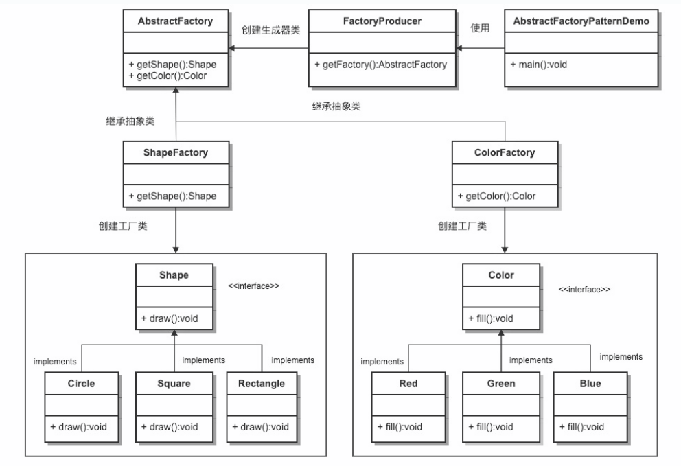

## 意图
提供一个创建一系列相关或相互依赖对象的接口，而无需指定它们的具体类。抽象工厂模式属于创建型模式。

## 主要解决
接口选择的问题。

## 适用场景
当系统需要创建多个相关或依赖的对象，而不需要指定具体类时。

## 解决方案
在一个产品族中定义多个产品，由具体工厂实现创建这些产品的方法。

## 关键代码
在一个工厂中聚合多个同类产品的创建方法。

## 应用实例
假设有不同类型的衣柜，每个衣柜（具体工厂）只能存放一类衣服（成套的具体产品），如商务装、时尚装等。每套衣服包括具体的上衣和裤子（具体产品）。所有衣柜都是衣柜类（抽象工厂）的具体实现，所有上衣和裤子分别实现上衣接口和裤子接口（抽象产品）。

## 优点
- 确保同一产品族的对象一起工作。
- 客户端不需要知道每个对象的具体类，简化了代码。

## 缺点
- 扩展产品族非常困难。增加一个新的产品族需要修改抽象工厂和所有具体工厂的代码。

## 使用场景
- QQ换皮肤时，整套皮肤一起更换。
- 创建跨平台应用时，生成不同操作系统的程序。

## 注意事项
增加新的产品族相对容易，而增加新的产品等级结构比较困难。

## 结构
抽象工厂模式包含以下几个主要角色：
- 抽象工厂（Abstract Factory）：声明了一组用于创建产品对象的方法，每个方法对应一种产品类型。抽象工厂可以是接口或抽象类。
- 具体工厂（Concrete Factory）：实现了抽象工厂接口，负责创建具体产品对象的实例。
- 抽象产品（Abstract Product）：定义了一组产品对象的共同接口或抽象类，描述了产品对象的公共方法。
- 具体产品（Concrete Product）：实现了抽象产品接口，定义了具体产品的特定行为和属性。
- 抽象工厂模式通常涉及一族相关的产品，每个具体工厂类负责创建该族中的具体产品。客户端通过使用抽象工厂接口来创建产品对象，而不需要直接使用具体产品的实现类。

## UML图

## 实现
1. 为形状创建一个接口（Shape）；
2. 创建实现形状接口的实体类（Circle、Rectangle、Square）；
3. 为颜色创建一个接口（Color）；
4. 创建实现颜色接口的实体类（Red、Green、Blue）；
5. 为颜色（Color）和形状（Shape）对象创建抽象类来获取工厂；
6. 创建扩展了 AbstractFactory 的工厂类（ShapeFactory、ColorFactory），基于给定的信息生成实体类的对象；
7. 创建一个工厂创造器/生成器类（FactoryProducer），通过传递形状或颜色信息来获取工厂:
8. 使用 FactoryProducer 来获取 AbstractFactory，通过传递类型信息来获取实体类的对象（AbstractFactoryPatternDemo）。
