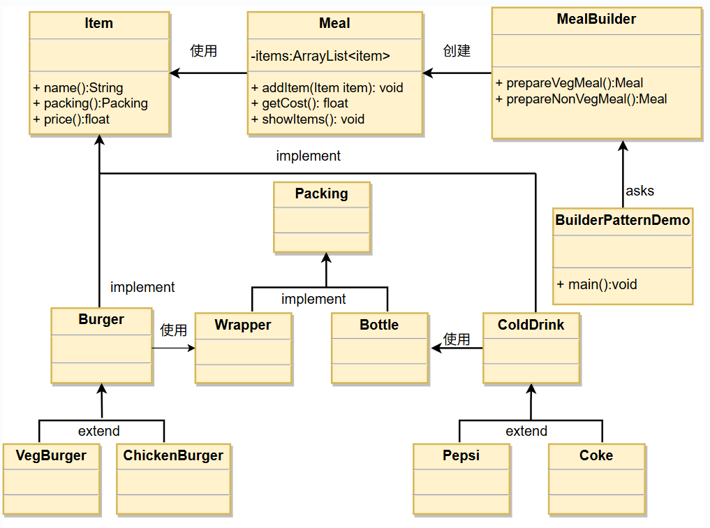

## 意图
将一个复杂的构建过程与其表示相分离，使得同样的构建过程可以创建不同的表示。

## 主要解决
在软件系统中，一个复杂对象的创建通常由多个部分组成，
这些部分的组合经常变化，但组合的算法相对稳定。

## 何时使用
当一些基本部件不变，而其组合经常变化时。

## 如何解决
将变与不变的部分分离开。

## 关键代码
- 建造者：创建并提供实例。
- 导演：管理建造出来的实例的依赖关系和控制构建过程。

## 应用实例
去肯德基，汉堡、可乐、薯条、炸鸡翅等是不变的，而其组合是经常变化的，
生成出不同的"套餐"。
Java 中的 StringBuilder。

## 优点
- 分离构建过程和表示，使得构建过程更加灵活，可以构建不同的表示。
- 可以更好地控制构建过程，隐藏具体构建细节。
- 代码复用性高，可以在不同的构建过程中重复使用相同的建造者。

## 缺点
- 如果产品的属性较少，建造者模式可能会导致代码冗余。
- 增加了系统的类和对象数量。

## 使用场景
- 需要生成的对象具有复杂的内部结构。
- 需要生成的对象内部属性相互依赖。

## 注意事项
与工厂模式的区别是：建造者模式更加关注于零件装配的顺序。

## 结构
建造者模式包含以下几个主要角色：
- 产品（Product）
> 要构建的复杂对象。产品类通常包含多个部分或属性。
- 抽象建造者（Builder）
> 定义了构建产品的抽象接口，包括构建产品的各个部分的方法。
- 具体建造者（Concrete Builder）
> 实现抽象建造者接口，具体确定如何构建产品的各个部分，
> 并负责返回最终构建的产品。
- 指导者（Director）
> 负责调用建造者的方法来构建产品，指导者并不了解具体的构建过程，
> 只关心产品的构建顺序和方式。

## 实现
我们假设一个快餐店的商业案例，
其中，一个典型的套餐可以是一个汉堡（Burger）和一杯冷饮（Cold drink）。
汉堡（Burger）可以是素食汉堡（Veg Burger）或鸡肉汉堡（Chicken Burger），
它们是包在纸盒中。
冷饮（Cold drink）可以是可口可乐（coke）或百事可乐（pepsi），
它们是装在瓶子中。
我们将创建一个表示食物条目（比如汉堡和冷饮）的 Item 接口
和实现 Item 接口的实体类，
以及一个表示食物包装的Packing接口和实现Packing接口的实体类，
汉堡是包在纸盒中，冷饮是装在瓶子中。
然后我们创建一个 Meal 类，
带有Item的ArrayList
和一个通过结合Item来创建不同类型的Meal对象的MealBuilder。
BuilderPatternDemo类使用MealBuilder来创建一个Meal。

## UML图

## 步骤
1. 创建一个表示食物条目和食物包装的接口；
2. 创建实现Packing接口的实体类；
3. 创建实现 Item 接口的抽象类，该类提供了默认的功能；
4. 创建扩展了Burger和ColdDrink的实体类；
5. 创建一个Meal类，带有上面定义的Item对象；
6. 创建一个MealBuilder类，实际的builder类负责创建Meal对象；
7. BuiderPatternDemo使用MealBuilder来演示建造者模式（Builder Pattern）。
