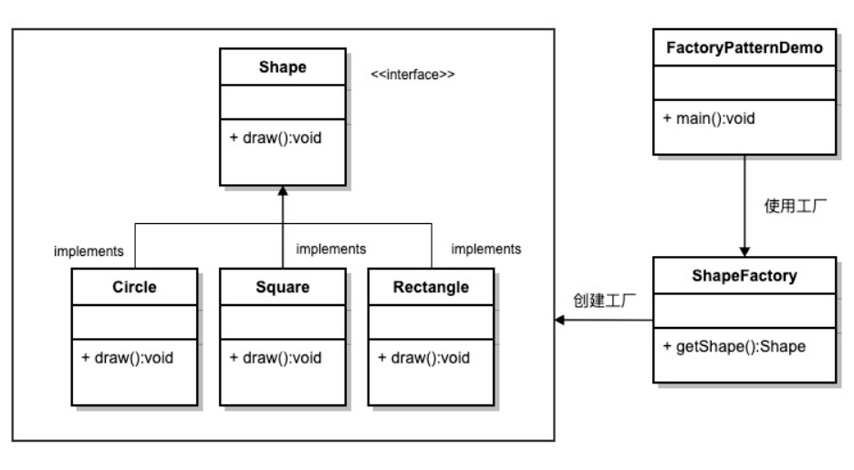

## 意图
定义一个创建对象的接口，让其子类决定实例化哪一个具体的类。工厂模式使对象的创建过程延迟到子类。属于创建型模式。

## 主要解决
接口选择的问题。

## 何时使用
当我们需要在不同条件下创建不同实例时。

## 如何解决
通过让子类实现工厂接口，返回一个抽象的产品。

## 关键代码
对象的创建过程在子类中实现。

## 应用实例
汽车制造：你需要一辆汽车，只需从工厂提货，而不需要关心汽车的制造过程及其内部实现。
Hibernate：更换数据库时，只需更改方言（Dialect）和数据库驱动（Driver），即可实现对不同数据库的切换。

## 优点
- 调用者只需要知道对象的名称即可创建对象。
- 扩展性高，如果需要增加新产品，只需扩展一个工厂类即可。
- 屏蔽了产品的具体实现，调用者只关心产品的接口。

## 缺点
- 每次增加一个产品时，都需要增加一个具体类和对应的工厂，使系统中类的数量成倍增加，增加了系统的复杂度和具体类的依赖。

## 使用场景
- 日志记录：日志可能记录到本地硬盘、系统事件、远程服务器等，用户可以选择记录日志的位置。
- 数据库访问：当用户不知道最终系统使用哪种数据库，或者数据库可能变化时。
- 连接服务器的框架设计：需要支持 "POP3"、"IMAP"、"HTTP" 三种协议，可以将这三种协议作为产品类，共同实现一个接口。

## 注意事项
工厂模式适用于生成复杂对象的场景。如果对象较为简单，通过 new 即可完成创建，则不必使用工厂模式。使用工厂模式会引入一个工厂类，增加系统复杂度。

## 结构
工厂模式包含以下几个主要角色：
- 抽象产品（Abstract Product）：定义了产品的共同接口或抽象类。它可以是具体产品类的父类或接口，规定了产品对象的共同方法。
- 具体产品（Concrete Product）：实现了抽象产品接口，定义了具体产品的特定行为和属性。
- 抽象工厂（Abstract Factory）：声明了创建产品的抽象方法，可以是接口或抽象类。它可以有多个方法用于创建不同类型的产品。
- 具体工厂（Concrete Factory）：实现了抽象工厂接口，负责实际创建具体产品的对象。

## UML图

## 实现
1. 创建一个接口（Shapte）;
2. 创建实现接口的实体类（Circle、Rectangle、Square）；
3. 创建一个工厂，生成基于给定信息的实体类的对象（ShapeFactory）；
4. 使用该工厂，通过传递类型信息来获取实体类的对象（FactoryMethodPatternDemo）。

