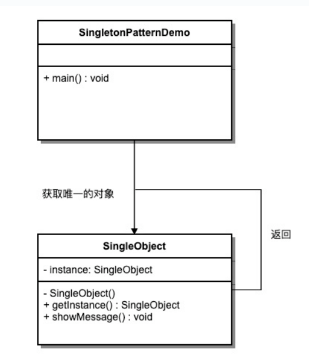

## 意图
确保一个类只有一个实例，并提供一个全局访问点来访问该实例。

## 主要解决
频繁创建和销毁全局使用的类实例的问题。

## 何时使用
当需要控制实例数目，节省系统资源时。

## 如何解决
检查系统是否已经存在该单例，如果存在则返回该实例；如果不存在则创建一个新实例。

## 关键代码
构造函数是私有的。

## 应用实例
一个班级只有一个班主任。
Windows 在多进程多线程环境下操作文件时，避免多个进程或线程同时操作一个文件，需要通过唯一实例进行处理。
设备管理器设计为单例模式，例如电脑有两台打印机，避免同时打印同一个文件。

## 优点
内存中只有一个实例，减少内存开销，尤其是频繁创建和销毁实例时（如管理学院首页页面缓存）。
避免资源的多重占用（如写文件操作）。

## 缺点
没有接口，不能继承。
与单一职责原则冲突，一个类应该只关心内部逻辑，而不关心实例化方式。

## 使用场景
生成唯一序列号。
WEB 中的计数器，避免每次刷新都在数据库中增加计数，先缓存起来。
创建消耗资源过多的对象，如 I/O 与数据库连接等。

## 注意事项
线程安全：getInstance() 方法中需要使用同步锁 synchronized (Singleton.class) 防止多线程同时进入造成实例被多次创建。
延迟初始化：实例在第一次调用 getInstance() 方法时创建。
序列化和反序列化：重写 readResolve 方法以确保反序列化时不会创建新的实例。
反射攻击：在构造函数中添加防护代码，防止通过反射创建新实例。
类加载器问题：注意复杂类加载环境可能导致的多个实例问题。

## 结构
单例模式包含以下几个主要角色：
- 单例类：包含单例实例的类，通常将构造函数声明为私有。
- 静态成员变量：用于存储单例实例的静态成员变量。
- 获取实例方法：静态方法，用于获取单例实例。
- 私有构造函数：防止外部直接实例化单例类。
- 线程安全处理：确保在多线程环境下单例实例的创建是安全的。

## UML图

## 实现
1. 懒汉式，线程不安全（Singleton1）；
2. 懒汉式，线程安全（Singleton2）；
3. 饿汉式（Singleton3）；
4. 双检锁/双重校验锁（DCL，即 double-checked locking）（Singleton4）；
5. 登记式/静态内部类（Singleton5）；
6. 枚举（Singleton6）；
> 一般情况下，不建议使用第1种和第2种懒汉方式，建议使用第3种饿汉方式。
只有在要明确实现lazy loading效果时，才会使用第5种登记方式。
如果涉及到反序列化创建对象时，可以尝试使用第6种枚举方式。
如果有其他特殊的需求，可以考虑使用第4种双检锁方式。