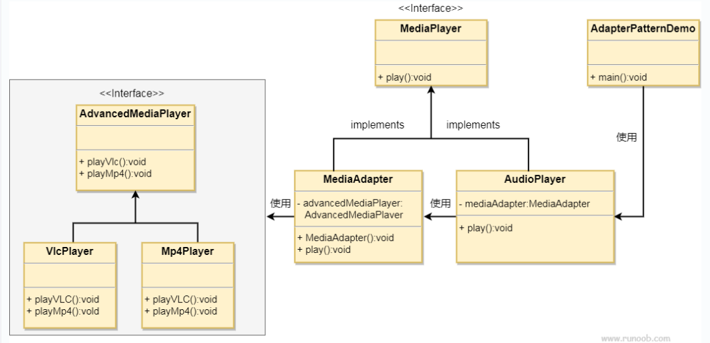

## 目的
将一个类的接口转换为另一个接口，使得原本不兼容的类可以协同工作。

## 主要解决的问题
在软件系统中，需要将现有的对象放入新环境，
而新环境要求的接口与现有对象不匹配。

## 使用场景
- 需要使用现有类，但其接口不符合系统需求。
- 希望创建一个可复用的类，与多个不相关的类（包括未来可能引入的类）一起工作，
这些类可能没有统一的接口。
- 通过接口转换，将一个类集成到另一个类系中。

## 实现方式
继承或依赖：推荐使用依赖关系，而不是继承，以保持灵活性。

## 关键代码
适配器通过继承或依赖现有对象，并实现所需的目标接口。

## 应用实例
- 电压适配器：将 110V 电压转换为 220V，以适配不同国家的电器标准。
- 接口转换：例如，将 Java JDK 1.1 的 Enumeration 接口转换为 1.2 的 Iterator 接口。
- 跨平台运行：在Linux上运行Windows程序。
- 数据库连接：Java 中的 JDBC 通过适配器模式与不同类型的数据库进行交互。

## 优点
- 促进了类之间的协同工作，即使它们没有直接的关联。
- 提高了类的复用性。
- 增加了类的透明度。
- 提供了良好的灵活性。

## 缺点
- 过度使用适配器可能导致系统结构混乱，难以理解和维护。
- 在Java中，由于只能继承一个类，因此只能适配一个类，且目标类必须是抽象的。

## 使用建议
- 适配器模式应谨慎使用，特别是在详细设计阶段，它更多地用于解决现有系统的问题。
- 在考虑修改一个正常运行的系统接口时，适配器模式是一个合适的选择。
通过这种方式，适配器模式可以清晰地表达其核心概念和应用，同时避免了不必要的复杂性。

## 结构
适配器模式包含以下几个主要角色：
- 目标接口（Target）：定义客户需要的接口。
- 适配者类（Adaptee）：定义一个已经存在的接口，这个接口需要适配。
- 适配器类（Adapter）：实现目标接口，并通过组合或继承的方式调用适配者类中的方法，从而实现目标接口。

## 实现
我们有一个MediaPlayer接口和一个实现了MediaPlayer接口的实体类AudioPlayer。
默认情况下，AudioPlayer可以播放mp3格式的音频文件。
我们还有另一个接口AdvancedMediaPlayer和
实现了AdvancedMediaPlayer接口的实体类。
该类可以播放vlc和mp4格式的文件。
我们想要让AudioPlayer播放其他格式的音频文件。
为了实现这个功能，我们需要创建一个实现了MediaPlayer接口的适配器类MediaAdapter，
并使用AdvancedMediaPlayer对象来播放所需的格式。
AudioPlayer使用适配器类MediaAdapter传递所需的音频类型，
不需要知道能播放所需格式音频的实际类。
AdapterPatternDemo类使用AudioPlayer类来播放各种格式。

## UML图

## 步骤
1. 为媒体播放器和更高级的媒体播放器创建接口（MediaPlayer，AdvancedMediaPlayer）；
2. 创建实现了AdvancedMediaPlayer接口的实体类（VlcPlayer，Mp4Player）；
3. 创建实现了MediaPlayer接口的适配器类（MediaAdapter）；
4. 创建实现了MediaPlayer接口的实体类（AudioPlayer）；
5. 使用AudioPlayer来播放不同类型的音频格式（AdapterPatternDemo）。