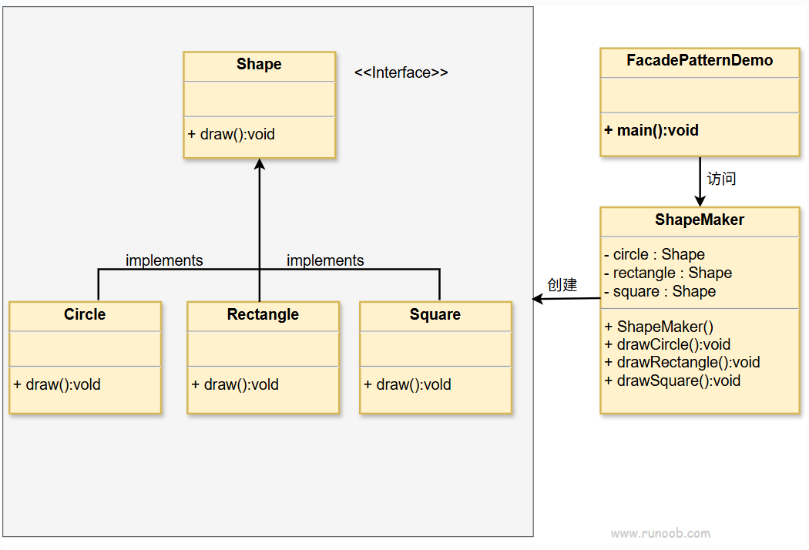

## 意图
为一个复杂的子系统提供一个一致的高层接口。
这样，客户端代码就可以通过这个简化的接口与子系统交互，
而不需要了解子系统内部的复杂性。

## 主要解决的问题
- 降低客户端与复杂子系统之间的耦合度。
- 简化客户端对复杂系统的操作，隐藏内部实现细节。

## 使用场景
- 当客户端不需要了解系统内部的复杂逻辑和组件交互时。
- 当需要为整个系统定义一个清晰的入口点时。

## 实现方式
- 创建外观类：定义一个类（外观），作为客户端与子系统之间的中介。
- 封装子系统操作：外观类将复杂的子系统操作封装成简单的方法。

## 关键代码
- Facade类：提供高层接口，简化客户端与子系统的交互。
- 子系统类：实现具体的业务逻辑，被Facade类调用。

## 应用实例
- 医院接待：医院的接待人员简化了挂号、门诊、划价、取药等复杂流程。
- Java三层架构：通过外观模式，可以简化对表示层、业务逻辑层和数据访问层的访问。

## 优点
- 减少依赖：客户端与子系统之间的依赖减少。
- 提高灵活性：子系统的内部变化不会影响客户端。
- 增强安全性：隐藏了子系统的内部实现，只暴露必要的操作。

## 缺点
违反开闭原则：对子系统的修改可能需要对外观类进行相应的修改。

## 使用建议
- 在需要简化复杂系统访问时使用外观模式。
- 确保外观类提供的方法足够简单，以便于客户端使用。

## 注意事项
- 外观模式适用于层次化结构，可以为每一层提供一个清晰的入口。
- 避免过度使用外观模式，以免隐藏过多的细节，导致维护困难。

## 结构
外观模式涉及以下核心角色：
- 外观（Facade）:
> 提供一个简化的接口，封装了系统的复杂性。外观模式的客户端通过与外观对象交互，而无需直接与系统的各个组件打交道。
- 子系统（Subsystem）:
> 由多个相互关联的类组成，负责系统的具体功能。外观对象通过调用这些子系统来完成客户端的请求。
- 客户端（Client）:
> 使用外观对象来与系统交互，而不需要了解系统内部的具体实现。

## 实现
我们将创建一个Shape接口和实现了Shape接口的实体类。
下一步是定义一个外观类ShapeMaker。
ShapeMaker类使用实体类来代表用户对这些类的调用。
FacadePatternDemo类使用ShapeMaker类来显示结果。

## UML图

## 步骤
1. 创建一个形状接口（Shape）；
2. 创建实现接口的实体类（Rectangle、Square、Circle）；
3. 创建一个外观类（ShapeMaker）；
4. 使用该外观类画出各种类型的形状（FacadePatternDemo）。