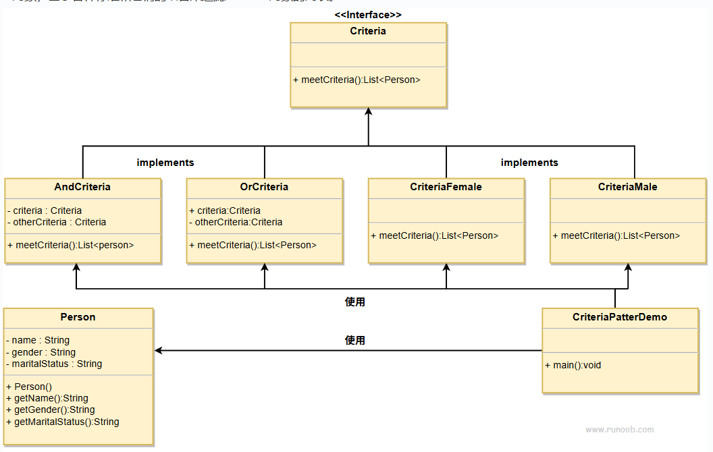

## 意图
用于将对象的筛选过程封装起来，允许使用不同的筛选标准动态地筛选对象。

## 主要解决的问题
当需要根据多个不同的条件或标准来筛选一组对象时，
过滤器模式提供了一种灵活的方式来定义这些条件，
避免在客户端代码中硬编码筛选逻辑。

## 使用场景
- 当对象集合需要根据不同的标准进行筛选时。
- 当筛选逻辑可能变化，或者需要动态地组合多个筛选条件时。

## 实现方式
- 定义筛选接口：创建一个筛选接口，定义一个筛选方法。
- 实现具体筛选器：为每个筛选标准实现筛选接口，封装具体的筛选逻辑。
- 组合筛选器：允许筛选器之间进行组合，形成复杂的筛选逻辑。

## 关键代码
- 筛选接口：定义筛选方法，如 matches()。
- 具体筛选器类：实现筛选接口，封装具体的筛选逻辑。
- 组合筛选器：实现筛选器的组合逻辑，如逻辑与（AND）、逻辑或（OR）等。

## 应用实例
- 图书管理系统：根据作者、出版年份、类别等不同标准筛选图书。
- 在线购物平台：根据价格、品牌、用户评分等条件筛选商品。

## 优点
- 封装性：筛选逻辑被封装在独立的筛选器对象中。
- 灵活性：可以动态地添加、修改或组合筛选条件。
- 可扩展性：容易添加新的筛选标准，无需修改现有代码。

## 缺点
- 复杂性：随着筛选条件的增加，系统可能变得复杂。
- 性能问题：如果筛选器组合过于复杂，可能会影响性能。

## 使用建议
- 当筛选逻辑可能变化或需要根据不同标准动态筛选对象时，考虑使用过滤器模式。
- 在设计时，确保筛选器的接口和实现保持一致，以便于组合和扩展。

## 注意事项
- 确保筛选器的组合逻辑正确无误，避免引入逻辑错误。
- 在实现时，考虑性能影响，特别是在处理大量数据时。

## 概要
过滤器模式包含以下几个主要角色：
- 过滤器接口（Filter/Criteria）：定义一个接口，用于筛选对象。该接口通常包含一个方法，用于根据特定条件过滤对象。
- 具体过滤器类（Concrete Filter/Concrete Criteria）：实现过滤器接口，具体定义筛选对象的条件和逻辑。
- 对象集合（Items/Objects to be filtered）：要被过滤的对象集合。这些对象通常是具有共同属性的实例，例如一组人、一组产品等。
- 客户端（Client）：使用具体过滤器类来筛选对象集合。客户端将对象集合和过滤器结合起来，以获得符合条件的对象。

## 实现
我们将创建一个 Person 对象、Criteria 接口和实现了该接口的实体类，来过滤 Person 对象的列表。CriteriaPatternDemo 类使用 Criteria 对象，基于各种标准和它们的结合来过滤 Person 对象的列表。

## UML图

## 步骤
1. 创建一个类，在该类上应用标准（Person）；
2. 为标准（Criteria）创建一个接口；
3. 创建实现了Criteria接口的实体类（CriteriaMale、CriteriaFemale、CriteriaSingle、AndCriteria、OrCriteria）；
4. 使用不同的标准（Criteria）和它们的结合来过滤Person对象的列表（CriteriaPatternDemo）。