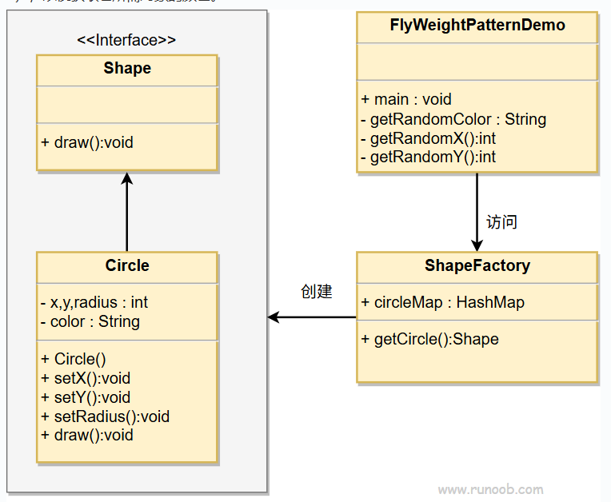

## 意图
通过共享对象来减少创建大量相似对象时的内存消耗。

## 主要解决的问题
- 避免因创建大量对象而导致的内存溢出问题。
- 通过共享对象，提高内存使用效率。

## 使用场景
- 当系统中存在大量相似或相同的对象。
- 对象的创建和销毁成本较高。
- 对象的状态可以外部化，即对象的部分状态可以独立于对象本身存在。

## 实现方式
- 定义享元接口：创建一个享元接口，规定可以共享的状态。
- 创建具体享元类：实现该接口的具体类，包含内部状态。
- 使用享元工厂：创建一个工厂类，用于管理享元对象的创建和复用。

## 关键代码
HashMap：使用哈希表存储已经创建的享元对象，以便快速检索。

## 应用实例
- Java中的String对象：字符串常量池中已经存在的字符串会被复用。
- 数据库连接池：数据库连接被复用，避免频繁创建和销毁连接。

## 优点
- 减少内存消耗：通过共享对象，减少了内存中对象的数量。
- 提高效率：减少了对象创建的时间，提高了系统效率。

## 缺点
- 增加系统复杂度：需要分离内部状态和外部状态，增加了设计和实现的复杂性。
- 线程安全问题：如果外部状态处理不当，可能会引起线程安全问题。

## 使用建议
- 在创建大量相似对象时考虑使用享元模式。
- 确保享元对象的内部状态是共享的，而外部状态是独立于对象的。

## 注意事项
- 状态分离：明确区分内部状态和外部状态，避免混淆。
- 享元工厂：使用享元工厂来控制对象的创建和复用，确保对象的一致性和完整性。

## 结构
享元模式包含以下几个核心角色：
- 享元工厂（Flyweight Factory）:
> 负责创建和管理享元对象，通常包含一个池（缓存）用于存储和复用已经创建的享元对象。
- 具体享元（Concrete Flyweight）:
> 实现了抽象享元接口，包含了内部状态和外部状态。内部状态是可以被共享的，而外部状态则由客户端传递。
- 抽象享元（Flyweight）:
> 定义了具体享元和非共享享元的接口，通常包含了设置外部状态的方法。
- 客户端（Client）:
> 使用享元工厂获取享元对象，并通过设置外部状态来操作享元对象。客户端通常不需要关心享元对象的具体实现。

## 实现
我们将创建一个Shape接口和实现了Shape接口的实体类Circle。
下一步是定义工厂类ShapeFactory。
ShapeFactory有一个Circle的HashMap，其中键名为Circle对象的颜色。
无论何时接收到请求，都会创建一个特定颜色的圆。
ShapeFactory检查它的HashMap中的circle对象，
如果找到Circle对象，则返回该对象，
否则将创建一个存储在hashmap中以备后续使用的新对象，
并把该对象返回到客户端。
FlyWeightPatternDemo类使用ShapeFactory来获取Shape对象。
它将向ShapeFactory传递信息（red/green/blue/black/white），
以便获取它所需对象的颜色。

## UML图

## 步骤
1. 创建一个形状接口（Shape）；
2. 创建实现接口的实体类（Circle）；
3. 创建一个工厂，生成基于给定信息的实体类的对象（ShapeFactory）；
4. 使用该工厂，通过传递颜色信息来获取实体类的对象（FlyweightPatternDemo）。