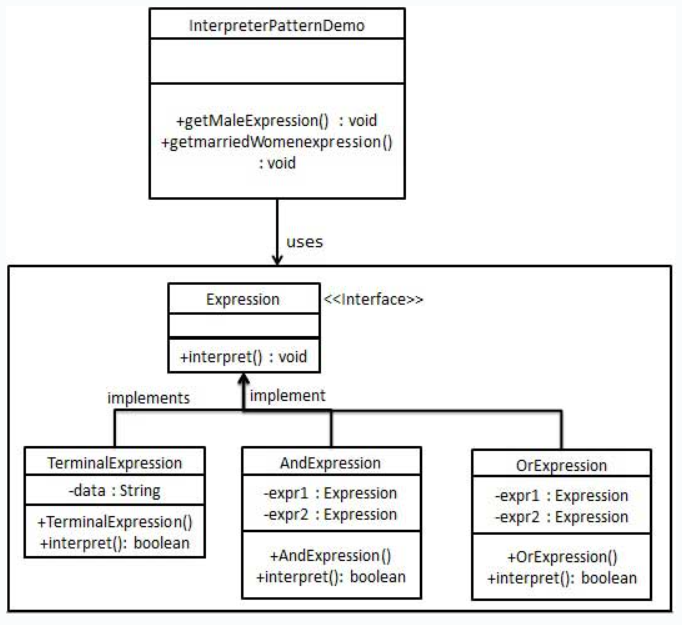

## 意图
允许顺序访问一个聚合对象中的元素，同时不暴露对象的内部表示。

## 主要解决的问题
提供一种统一的方法来遍历不同的聚合对象。

## 使用场景
当需要遍历一个聚合对象，而又不希望暴露其内部结构时。

## 实现方式
- 定义迭代器接口：包含hasNext()和next()等方法，用于遍历元素。
- 创建具体迭代器：实现迭代器接口，定义如何遍历特定的聚合对象。
- 聚合类：定义一个接口用于返回一个迭代器对象。

## 关键代码
- 迭代器接口：规定了遍历元素的方法。
- 具体迭代器：实现了迭代器接口，包含遍历逻辑。

## 应用实例
Java中的Iterator：Java集合框架中的迭代器用于遍历集合元素。

## 优点
- 支持多种遍历方式：不同的迭代器可以定义不同的遍历方式。
- 简化聚合类：聚合类不需要关心遍历逻辑。
- 多遍历支持：可以同时对同一个聚合对象进行多次遍历。
- 扩展性：增加新的聚合类和迭代器类都很方便，无需修改现有代码。

## 缺点
系统复杂性：每增加一个聚合类，就需要增加一个对应的迭代器类，增加了类的数量。

## 使用建议
- 当需要访问聚合对象内容而不暴露其内部表示时，使用迭代器模式。
- 当需要为聚合对象提供多种遍历方式时，考虑使用迭代器模式。

## 注意事项
迭代器模式通过分离集合对象的遍历行为，使得外部代码可以透明地访问集合内部数据，同时不暴露集合的内部结构。

## 结构
迭代器模式包含以下几个主要角色：
- 迭代器接口（Iterator）：
> 定义了访问和遍历聚合对象中各个元素的方法，
> 通常包括获取下一个元素、判断是否还有元素、获取当前位置等方法。
- 具体迭代器（Concrete Iterator）：
> 实现了迭代器接口，负责对聚合对象进行遍历和访问，
> 同时记录遍历的当前位置。
- 聚合对象接口（Aggregate）：
> 定义了创建迭代器对象的接口，
> 通常包括一个工厂方法用于创建迭代器对象。
- 具体聚合对象（Concrete Aggregate）：
> 实现了聚合对象接口，负责创建具体的迭代器对象，
> 并提供需要遍历的数据。

## 实现
我们将创建一个叙述导航方法的Iterator接口
和一个返回迭代器的Container接口。
实现了Container接口的实体类将负责实现Iterator接口。
IteratorPatternDemo，我们的演示类使用实体类NamesRepository
来打印NamesRepository中存储为集合的Names。

## UML图

## 步骤
1. 创建接口（Iterator、Container）；
2. 创建实现了Container接口的实体类。 该类有实现了Iterator接口的内部类NameIterator（NameRepository）；
3. 使用NameRepository来获取迭代器，并打印名字（IteratorPatternDemo）。